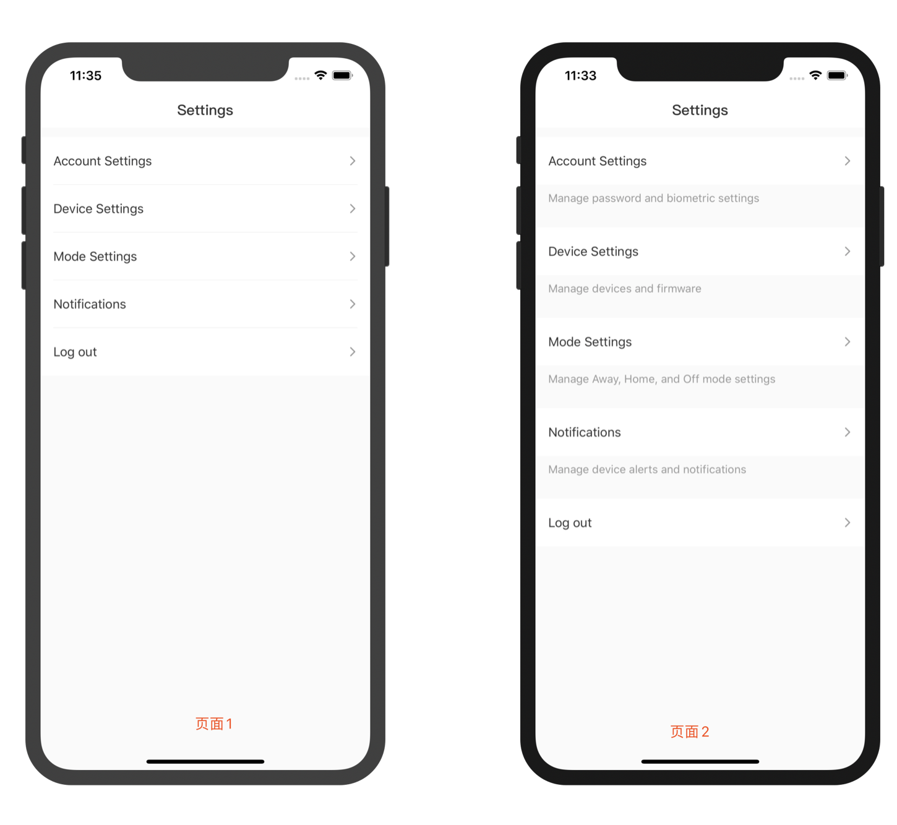
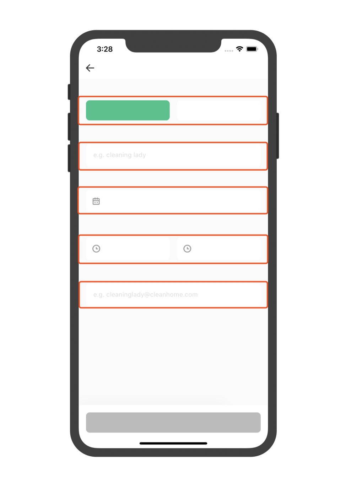
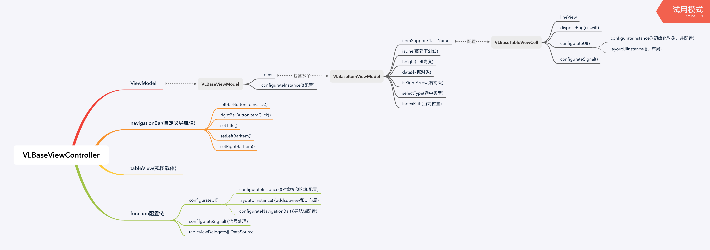

# VerticalLayout
####在开发APP过程中遇到的问题：
- 平时开发过程中经常会遇到一些需求的变更，看似变动不大实则有多个地方需要进行适配，例如

原来的解决办法：
第一种：添加tableview的sectionview，然后配置section的高度
第二种：再使用一种文字秒速的cell，然后设置cell间的高度
上述办法带来的问题：
我们不仅需要针对tablview的数据源做变动，还要调整tableView的delegate，如果出现间距不一致的情况，我们还需要针对所在的section和row进行一系列的判断配置，这是比较麻烦的

- 平时开发过程中会遇到相似UI，或者配置相同但是局部不一样的UI，例如textField


原来的解决办法：
第一种：在需要使用的地方去配置对应textfield
上述办法带来的问题：
重复性的配置工作比较多，如果textfield都要改动的时候，需要配置的页面多

- 在版本迭代的时候，一个原本静态的页面，在这个版本或者小屏幕中需要支持滑动
原来的解决办法：
第一种：把原来的静态页面加载在scrollview上，再配置
上述办法带来的问题：
当页面发生调整的时候，我们需要再次手动的去调整contentsize，同时，由静态页面变动到动态页面，需要更改和设置较多的配置

####UI垂直布局框架：
* 思想：根据对应UI设计稿进行拆分，拆分方法为垂直拆分，即把页面拆成高度不等，宽度相同的小块再用list（UITableView）容器进行加载，如图所示：


* 实现结构：


* 代码实现示例:
[LoginViewController](https://github.com/cjw429672039/VerticalLayout/blob/master/VerticalLayout-Swift/Demo/Project/Login/ViewController/LoginViewController.swift)
[LoginViewModel](https://github.com/cjw429672039/VerticalLayout/blob/master/VerticalLayout-Swift/Demo/Project/Login/ViewModel/LoginViewModel.swift)
[SettingViewController](https://github.com/cjw429672039/VerticalLayout/blob/master/VerticalLayout-Swift/Demo/Project/Login/ViewController/SettingViewController.swift)
[SettingViewModel](https://github.com/cjw429672039/VerticalLayout/blob/master/VerticalLayout-Swift/Demo/Project/Login/ViewModel/SettingViewModel.swift)
* 局限：
1.对于不规整的页面只能进行整体封装
2.对于section的悬停，目前还是只能用tableView固有的方式实现，还没有加以优化
* 优点：
1.Swift版本UI垂直布局框架是结合RxSwift进行实现，能把cell的事件信号传递到外部
OC版本的UI垂直布局框架是结合RAC进行实现的，也能把cell的事件信号传递到外部
2.[EmptyItemViewModel](https://github.com/cjw429672039/VerticalLayout/blob/master/VerticalLayout-Swift/Demo/Project/BaseItems/EmptyItemViewModel/EmptyItemViewModel.swift)的使用，可以减少我们对cell间的间隔在tableView代理的配置
3.ItemViewModel和TableViewCell的使用和一对一的绑定机制，方便了我们对cell组件多样化形式的封装和实现，避免了轮子的重复制造，一对一的形式使得项目更加清晰
4.tableView的加载机制和cell的复用机制，简化处理了各个组件的加载，让我们更专注与轮子的制造以及业务逻辑代码的实现，由于cell也是继承与UIView的，所以也可以当做一个普通的UI组件使用
5.cell的[统一加载](https://github.com/cjw429672039/VerticalLayout/blob/master/VerticalLayout-Swift/VerticalLayoutFramework/VLBaseTableViewCell.swift)方式,让我们不用再关注cell的注册，专注于cell的使用和配置
6.VerticalLayout整体框架的使用可以让开发者更专注于业务逻辑的编写和极大的降低了ViewController，ViewModel的代码量

####实际开发实例讲解
SettingViewController
```
import UIKit
//继承于VLBaseViewController
class SettingViewController: VLBaseViewController {
    //重写viewModel信号接收
    override func handle(controllerResponse action: ViewControllerActionProtocol) {
        //信号处理
        guard let action = action as? SettingControllerAction  else {
            return
        }
        switch action {
        case .logout:
            UserDefaults.standard.set(false, forKey: "isLogin")
            AppDelegate.shared.settingAPPRootVC()
        }
    }
}

extension SettingViewController {
    // MARK: - 对象配置
    override func configurateUI() {
        super.configurateUI()
        
    }
    
    // MARK: - 对象布局
    override func layoutUIInstance() {
        super.layoutUIInstance()
        
    }
    
    // MARK: - 对象实例化
    override func configurateInstance() {
        super.configurateInstance()
        
    }
                            
    // MARK: - 导航栏设置
    override func configurateNavigationBar() {
        super.configurateNavigationBar()
        
        self.setTitle(title: "Settings")
    }
}
```
SettingViewModel
```
import UIKit
//遵循ItemViewModel cell点击事件协议
enum SettingSelectType: SelectType {
    case showSimple
    case showComplex
    case mode
    case notifications
    case logout
}
//遵循ViewModel信号传出事件协议
enum SettingControllerAction: ViewControllerActionProtocol {
    case logout
}
//遵循弹窗事件协议
enum SettingAlertType: AlertViewActionProtocol {
    case cancel
    case logout
}
//继承于VLBaseViewModel
class SettingViewModel: VLBaseViewModel {
    //重写Controller传入信号方法，这个方法用于存放信号绑定代码块
    override func signalTransform(input: VLBaseViewModel.SignalInput) -> VLBaseViewModel.SignalOutput {
        
        return super.signalTransform(input: input)
    }
    //重写弹窗处理方法，对弹窗事件进行处理
    override func handle(alertClick action: AlertViewActionProtocol) {
        guard let action = action as? SettingAlertType else {
            return
        }
        
        switch action {
        case .logout:
            self.viewControllerAction.accept(SettingControllerAction.logout)
        default:
            break
        }
    }
    //重写tablviewdian
    override func handle(tableClick action: SelectType) {
        guard let action = action as? SettingSelectType else {
            return
        }
        
        switch action {
        case .showComplex:
            self.showComplex()
        case .showSimple:
            self.showSimple()
        case .logout:
            self.alertViewAction.accept(.double(title: "Log out",
                                                msg: nil,
                                                firstButton: "Cancel",
                                                secondButton: "OK",
                                                actions: [SettingAlertType.cancel, SettingAlertType.logout],
                                                colors: nil))
        default:
            break
        }
    }
}

extension SettingViewModel {
                        
    //items配置以及其他数据配置(在init调用)
    override func configurateInstance() {
        super.configurateInstance()
        self.showSimple()
    }
    
    func showSimple() {
        self.items = [[
        EmptyItemViewModel(VLScaleHeight(12)),
        TextListItemViewModel(leftText: "Show Simple",
                              line: true,
                              arrow: true,
                              selectType: SettingSelectType.showSimple),
        TextListItemViewModel(leftText: "Show Complex",
                              line: true,
                              arrow: true,
                              selectType: SettingSelectType.showComplex),
        TextListItemViewModel(leftText: "Mode Settings",
                              line: true,
                              arrow: true,
                              selectType: SettingSelectType.mode),
        TextListItemViewModel(leftText: "Notifications",
                              line: true,
                              arrow: true,
                              selectType: SettingSelectType.notifications),
        TextListItemViewModel(leftText: "Log out",
                              line: false,
                              arrow: true,
                              selectType: SettingSelectType.logout)
        ]]
        self.tableViewAction.accept(.reload)
    }
    
    func showComplex() {
        self.items = [[
        EmptyItemViewModel(VLScaleHeight(12)),
        TextListItemViewModel(leftText: "Show Simple",
                              line: false,
                              arrow: true,
                              selectType: SettingSelectType.showSimple),
        EmptyItemViewModel(VLScaleHeight(8)),
        TextItemViewModel(lightHintText: "Manage password and biometric settings", leftSpace: VLScaleWidth(16), rightSpace: -VLScaleWidth(16)),
        EmptyItemViewModel(VLScaleHeight(28)),
        TextListItemViewModel(leftText: "Show Complex",
                              line: false,
                              arrow: true,
                              selectType: SettingSelectType.showComplex),
        EmptyItemViewModel(VLScaleHeight(8)),
        TextItemViewModel(lightHintText: "Manage devices and firmware", leftSpace: VLScaleWidth(16), rightSpace: -VLScaleWidth(16)),
        EmptyItemViewModel(VLScaleHeight(28)),
        TextListItemViewModel(leftText: "Mode Settings",
                              line: false,
                              arrow: true,
                              selectType: SettingSelectType.mode),
        EmptyItemViewModel(VLScaleHeight(8)),
        TextItemViewModel(lightHintText: "Manage Away, Home, and Off mode settings", leftSpace: VLScaleWidth(16), rightSpace: -VLScaleWidth(16)),
        EmptyItemViewModel(VLScaleHeight(28)),
        TextListItemViewModel(leftText: "Notifications",
                              line: false,
                              arrow: true,
                              selectType: SettingSelectType.notifications),
        EmptyItemViewModel(VLScaleHeight(8)),
        TextItemViewModel(lightHintText: "Manage device alerts and notifications", leftSpace: VLScaleWidth(16), rightSpace: -VLScaleWidth(16)),
        EmptyItemViewModel(VLScaleHeight(28)),
        TextListItemViewModel(leftText: "Log out",
                              line: false,
                              arrow: true,
                              selectType: SettingSelectType.logout)
        ]]
        self.tableViewAction.accept(.reload)
    }
}
```